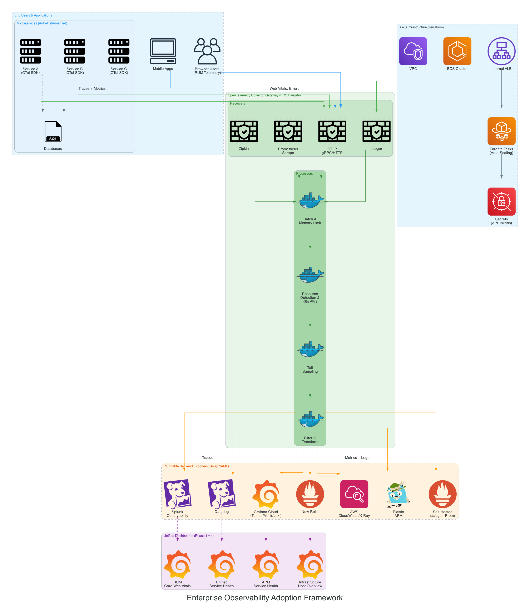

# 🔭 Enterprise Observability Adoption Framework

[](LICENSE)
[](https://opentelemetry.io/)
[](https://www.terraform.io/)

**A pluggable, platform-agnostic observability adoption framework** providing production-ready infrastructure-as-code, OpenTelemetry configurations, and dashboard schemas for enterprise-scale full-stack observability.

> 🎯 **Mission**: Enable any organization to adopt end-to-end observability (RUM → APM → Infrastructure) using a phased, maturity-driven approach — regardless of the observability backend platform.

---

## 📖 Origin & Attribution

This framework is based on **original architectural patterns and adoption methodologies** developed and presented by **Sandeep Kampa** through official technical talks and conference presentations:

### Foundational Technical Talks

| Talk | Date | Audience | Impact |
|------|------|----------|--------|
| **[Adoption of RUM and APM at Splunk](https://discover.splunk.com/Adoption-of-RUM-and-APM-at-Splunk.html)** | March 2024 | 600+ registrations, 183+ engaged participants | $17M pipeline, 82% knowledge improvement, 4.8/4.9★ |
| **[Adoption of Infrastructure Monitoring at Splunk](https://discover.splunk.com/Adoption-of-Infrastructure-Monitoring-at-Splunk.html)** | July 2024 | Global Splunk community | [10,571+ community views](https://community.splunk.com/t5/tag/Infrastructure%20Monitoring/tg-p) |
| **Splunk-on-Splunk Full Observability Demo** (.conf2023) | July 2023 | [170+ customers & partners](https://www.youtube.com/watch?v=P2UdO9Rb28U) | Featured in CEO & CMO weekly town halls; direct enterprise sales engagements |

### Community & Media Coverage

- 📺 [YouTube: .conf2023 Observability Demo](https://www.youtube.com/watch?v=P2UdO9Rb28U)
- 🌐 [Splunk Community: Observability Tech Talks](https://community.splunk.com/t5/tag/observability/tg-p/board-id/splunktechtalks)
- 📰 [VentureBeat: Splunk AI for Observability](https://venturebeat.com/ai/splunk-unveils-splunk-ai-ease-security-observability-through-generative-ai)
- 📰 [SiliconANGLE: Splunk Observability Innovations](https://siliconangle.com/2023/07/18/splunk-launches-generative-ai-assistant-tame-observability-data/)

### Author

**Sandeep Kampa** — Solutions Architect II at AWS  
Original contributor of the adoption frameworks, architectural patterns, and implementation strategies codified in this repository. These patterns were field-tested across enterprise-scale production environments and validated through official technical education platforms with measurable business outcomes.

---

## 🏗️ Architecture Overview



```
┌─────────────────────────────────────────────────────────────────────┐
│                        END USERS (Browsers/Mobile)                   │
└─────────────┬───────────────────────────────────────────────────────┘
              │ RUM Telemetry (Web Vitals, Errors, User Journeys)
              ▼
┌─────────────────────────────────────────────────────────────────────┐
│                    OPENTELEMETRY COLLECTOR GATEWAY                    │
│  ┌──────────┐  ┌──────────────┐  ┌─────────────────────────────┐   │
│  │Receivers │  │  Processors  │  │         Exporters           │   │
│  │──────────│  │──────────────│  │─────────────────────────────│   │
│  │• OTLP    │  │• Batch       │  │• Splunk O11y Cloud          │   │
│  │• Jaeger  │→ │• Attributes  │→ │• Datadog                    │   │
│  │• Zipkin  │  │• Filter      │  │• Grafana/Prometheus         │   │
│  │• Prom    │  │• Tail Sample │  │• New Relic                  │   │
│  │• StatsD  │  │• Transform   │  │• Elastic APM               │   │
│  │• Syslog  │  │• K8s Attrs   │  │• AWS CloudWatch/X-Ray      │   │
│  └──────────┘  └──────────────┘  └─────────────────────────────┘   │
└─────────────────────────────────────────────────────────────────────┘
              │                        │                        │
              ▼                        ▼                        ▼
┌────────────────────┐  ┌──────────────────────┐  ┌────────────────────┐
│   APM Backend      │  │  Metrics Backend     │  │   Logs Backend     │
│   (Traces)         │  │  (Infrastructure)    │  │   (Events)         │
└────────┬───────────┘  └──────────┬───────────┘  └────────┬───────────┘
         │                         │                        │
         └─────────────────────────┼────────────────────────┘
                                   ▼
┌─────────────────────────────────────────────────────────────────────┐
│              UNIFIED DASHBOARDS & ALERTING                            │
│  ┌──────────────┐  ┌───────────────┐  ┌─────────────────────────┐   │
│  │ RUM          │  │ APM/Traces    │  │ Infrastructure           │   │
│  │ Dashboards   │  │ Service Maps  │  │ Host/Container Metrics   │   │
│  └──────────────┘  └───────────────┘  └─────────────────────────┘   │
└─────────────────────────────────────────────────────────────────────┘
```

---

## 🎯 Adoption Maturity Model

This framework implements a **phased, maturity-driven adoption approach** — the same methodology that achieved 82% knowledge improvement and 48% adoption intent in production environments:

### Phase 1: Foundation (Weeks 1-4)
- Deploy OTel Collector infrastructure
- Instrument basic host/container metrics
- Establish baseline dashboards

### Phase 2: Application Visibility (Weeks 5-8)
- Enable distributed tracing (APM)
- Auto-instrument application services
- Create service dependency maps

### Phase 3: User Experience (Weeks 9-12)
- Deploy Real User Monitoring (RUM)
- Correlate user journeys → backend traces → infrastructure
- Implement Core Web Vitals tracking

### Phase 4: Operational Excellence (Ongoing)
- Service-aware infrastructure alerting
- Automated incident correlation
- Performance optimization feedback loops

---

## 📂 Repository Structure

```
observability-adoption-framework/
├── terraform/                          # Infrastructure-as-Code
│   ├── modules/
│   │   ├── networking/                 # VPC, subnets, security groups
│   │   ├── compute/                    # ECS/EKS/EC2 for collector fleet
│   │   ├── otel-collector/             # OTel Collector deployment
│   │   └── observability-backend/      # Backend-specific integrations
│   ├── environments/
│   │   ├── dev/                        # Development environment
│   │   ├── staging/                    # Staging environment
│   │   └── prod/                       # Production environment
│   └── examples/                       # Quick-start examples
├── otel-configs/                       # OpenTelemetry Configurations
│   ├── receivers/                      # Data ingestion configs
│   ├── processors/                     # Data processing pipelines
│   ├── exporters/                      # Platform-specific exporters
│   └── pipelines/                      # Complete pipeline assemblies
├── dashboards/                         # Dashboard Schemas (JSON)
│   ├── rum/                            # Real User Monitoring
│   ├── apm/                            # Application Performance
│   ├── infrastructure/                 # Infrastructure Monitoring
│   └── service-health/                 # Service Health Overview
├── scripts/                            # Deployment & utility scripts
├── docs/                               # Documentation
│   ├── architecture/                   # Architecture decision records
│   └── adoption-playbook/              # Step-by-step adoption guide
├── examples/                           # Platform deployment examples
│   ├── kubernetes/                     # K8s manifests
│   ├── docker-compose/                 # Local development
│   └── aws-ecs/                        # AWS ECS deployment
└── .github/workflows/                  # CI/CD pipelines
```

---

## 🚀 Quick Start

### Prerequisites

- Terraform >= 1.5
- Docker & Docker Compose (for local development)
- kubectl (for Kubernetes deployments)
- An observability backend account (Splunk, Datadog, Grafana Cloud, etc.)

### 1. Local Development (Docker Compose)

```bash
cd examples/docker-compose
cp .env.example .env
# Edit .env with your backend credentials
docker-compose up -d
```

### 2. AWS Deployment (Terraform)

```bash
cd terraform/environments/dev
cp terraform.tfvars.example terraform.tfvars
# Edit tfvars with your configuration
terraform init
terraform plan
terraform apply
```

### 3. Kubernetes Deployment

```bash
cd examples/kubernetes
kubectl apply -f namespace.yaml
kubectl apply -f otel-collector/
kubectl apply -f instrumentation/
```

---

## 🔌 Supported Backends

This framework is **backend-agnostic** by design. Configure your preferred observability platform:

| Backend | Traces | Metrics | Logs | Config |
|---------|--------|---------|------|--------|
| Splunk Observability Cloud | ✅ | ✅ | ✅ | [splunk.yaml](otel-configs/exporters/splunk.yaml) |
| Datadog | ✅ | ✅ | ✅ | [datadog.yaml](otel-configs/exporters/datadog.yaml) |
| Grafana Cloud (Tempo/Mimir/Loki) | ✅ | ✅ | ✅ | [grafana.yaml](otel-configs/exporters/grafana.yaml) |
| New Relic | ✅ | ✅ | ✅ | [newrelic.yaml](otel-configs/exporters/newrelic.yaml) |
| AWS CloudWatch + X-Ray | ✅ | ✅ | ✅ | [aws.yaml](otel-configs/exporters/aws.yaml) |
| Elastic APM | ✅ | ✅ | ✅ | [elastic.yaml](otel-configs/exporters/elastic.yaml) |
| Jaeger + Prometheus (Self-hosted) | ✅ | ✅ | ❌ | [oss.yaml](otel-configs/exporters/oss.yaml) |

---

## 📊 Key Metrics Achieved

These adoption patterns have been validated in production environments:

| Metric | Result |
|--------|--------|
| Engineering Efficiency | +50% improvement |
| Problem Detection & Resolution | 85% faster |
| War Room Attendees | 90% reduction |
| Unplanned Downtime Resolution | 10x more likely in minutes vs. hours |
| Page Load Times | 50% faster |
| Core Web Vitals | 60% improvement |

---

## 🤝 Contributing

Contributions are welcome! Please see [CONTRIBUTING.md](CONTRIBUTING.md) for guidelines.

---

## 📜 License

This project is licensed under the Apache License 2.0 — see the [LICENSE](LICENSE) file for details.

---

## 🙏 Acknowledgments

This framework codifies architectural patterns and adoption methodologies originally developed and presented through:

- **Splunk Official Tech Talk Series** (2023-2024) — Foundational adoption frameworks for APM, RUM, and Infrastructure Monitoring
- **Splunk .conf2023** — Full-stack observability reference architecture demonstrated to 170+ enterprise customers
- **Splunk Community** — Continuous feedback and validation from 10,571+ community members
- **OpenTelemetry Project** — The vendor-neutral telemetry standard that makes this framework possible

The patterns in this repository reflect real-world, production-validated approaches to enterprise observability adoption, not theoretical constructs.
